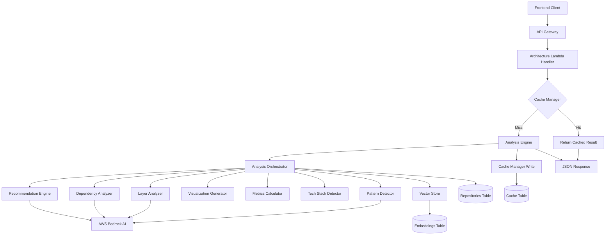
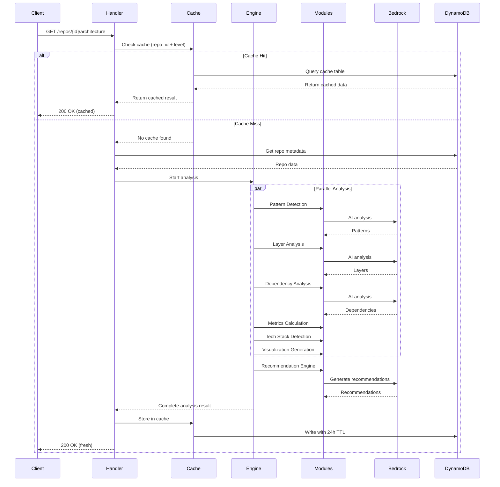

# Design Document: Enhanced Architecture Analysis System

## Overview

The Enhanced Architecture Analysis System transforms the existing basic architecture analysis endpoint into a production-grade, comprehensive analysis platform. The system analyzes codebases to detect architectural patterns, identify layers, generate multiple visualization formats, assess code quality metrics, detect security vulnerabilities, and provide actionable recommendations.

The system is built as a modular enhancement to the existing `architecture.py` Lambda handler, maintaining backward compatibility while adding rich analytical capabilities. It leverages AWS Bedrock for AI-powered analysis, DynamoDB for caching and storage, and integrates with the existing vector store for file content retrieval.

Key capabilities include:
- Detection of 8+ architectural patterns (MVC, Microservices, Event-Driven, etc.) with confidence scoring
- Multi-layer analysis (presentation, API, business, data, infrastructure)
- Generation of 4 diagram types in 3 formats (Mermaid, D3.js, Cytoscape.js)
- Technology stack detection with version, license, and vulnerability information
- Data flow scenario analysis with bottleneck identification
- Comprehensive dependency analysis including circular dependency detection
- Code quality metrics with health scoring and hotspot identification
- Intelligent recommendation engine for improvements
- 24-hour caching with sub-3-second cached response times

## Architecture

### System Architecture Diagram



### Component Interaction Flow



### Data Flow Architecture

The system follows a pipeline architecture with three main stages:

1. **Input Stage**: Request validation, cache lookup, metadata retrieval
2. **Analysis Stage**: Parallel execution of analysis modules with AI integration
3. **Output Stage**: Result aggregation, caching, response formatting

Data flows through the system as follows:
- Repository metadata and file summaries are retrieved from DynamoDB and vector store
- Context is built and passed to each analysis module
- Modules execute in parallel where possible (Pattern Detection, Layer Analysis, Tech Stack Detection, Metrics Calculation)
- Dependency Analysis and Visualization Generation depend on earlier module outputs
- Recommendation Engine runs last, consuming outputs from all other modules
- Final result is aggregated, cached, and returned

## Components and Interfaces

### 1. Analysis_Engine (Orchestrator)

**Responsibility**: Coordinates all analysis modules, manages execution flow, aggregates results

**Interface**:
```python
class AnalysisEngine:
    def analyze(
        self,
        repo_id: str,
        repo_metadata: Dict[str, Any],
        file_summaries: List[Dict[str, Any]],
        level: str
    ) -> ArchitectureAnalysis:
        """
        Orchestrate complete architecture analysis.
        
        Args:
            repo_id: Repository identifier
            repo_metadata: Repository metadata from DynamoDB
            file_summaries: File content summaries from vector store
            level: Analysis depth (basic/intermediate/advanced)
            
        Returns:
            Complete architecture analysis result
        """
        pass
```

**Dependencies**:
- Pattern_Detector
- Layer_Analyzer
- Dependency_Analyzer
- Visualization_Generator
- Metrics_Calculator
- Tech_Stack_Detector
- Recommendation_Engine

**Key Methods**:
- `analyze()`: Main orchestration method
- `_build_context()`: Prepare analysis context
- `_execute_parallel_modules()`: Run independent modules concurrently
- `_execute_dependent_modules()`: Run modules that depend on earlier results
- `_aggregate_results()`: Combine module outputs into final structure

### 2. Pattern_Detector

**Responsibility**: Detect architectural patterns with confidence scoring

**Interface**:
```python
class PatternDetector:
    SUPPORTED_PATTERNS = [
        'Layered', 'MVC', 'Microservices', 'Event-Driven',
        'CQRS', 'Clean Architecture', 'Hexagonal', 'Monolithic'
    ]
    
    def detect_patterns(
        self,
        context: AnalysisContext
    ) -> List[DetectedPattern]:
        """
        Detect architectural patterns in codebase.
        
        Args:
            context: Analysis context with repo metadata and file summaries
            
        Returns:
            List of detected patterns with confidence >= 0.5
        """
        pass
```

**Key Methods**:
- `detect_patterns()`: Main detection method using Bedrock AI
- `_calculate_confidence()`: Score pattern evidence
- `_extract_evidence_files()`: Identify supporting files
- `_get_pattern_metadata()`: Retrieve pros/cons/alternatives

### 3. Layer_Analyzer

**Responsibility**: Identify and categorize architectural layers and components

**Interface**:
```python
class LayerAnalyzer:
    LAYER_TYPES = ['presentation', 'api', 'business', 'data', 'infrastructure']
    
    def analyze_layers(
        self,
        context: AnalysisContext
    ) -> List[Layer]:
        """
        Analyze architectural layers and components.
        
        Args:
            context: Analysis context
            
        Returns:
            List of detected layers with components
        """
        pass
```

**Key Methods**:
- `analyze_layers()`: Main layer detection
- `_categorize_component()`: Assign component to layer
- `_analyze_component()`: Extract component details
- `_identify_connections()`: Find inter-layer connections

### 4. Dependency_Analyzer

**Responsibility**: Analyze package dependencies, detect circular dependencies, identify vulnerabilities

**Interface**:
```python
class DependencyAnalyzer:
    def analyze_dependencies(
        self,
        context: AnalysisContext
    ) -> DependencyAnalysis:
        """
        Analyze package dependencies and relationships.
        
        Args:
            context: Analysis context
            
        Returns:
            Complete dependency analysis with tree, cycles, vulnerabilities
        """
        pass
```

**Key Methods**:
- `analyze_dependencies()`: Main analysis method
- `_build_dependency_tree()`: Construct hierarchical tree
- `_detect_circular_dependencies()`: Find dependency cycles
- `_scan_vulnerabilities()`: Check for known CVEs
- `_check_outdated_packages()`: Compare with latest versions
- `_analyze_licenses()`: Check license compatibility

### 5. Visualization_Generator

**Responsibility**: Generate multiple diagram formats for interactive visualization

**Interface**:
```python
class VisualizationGenerator:
    DIAGRAM_TYPES = ['system_architecture', 'data_flow', 'dependency_graph', 'layer_diagram']
    FORMATS = ['mermaid', 'd3', 'cytoscape']
    
    def generate_visualizations(
        self,
        analysis_data: Dict[str, Any]
    ) -> Dict[str, Visualization]:
        """
        Generate all visualization formats.
        
        Args:
            analysis_data: Combined data from all analysis modules
            
        Returns:
            Dictionary of visualizations by diagram type
        """
        pass
```

**Key Methods**:
- `generate_visualizations()`: Generate all diagrams
- `_generate_mermaid()`: Create Mermaid syntax
- `_generate_d3_json()`: Create D3.js compatible JSON
- `_generate_cytoscape_json()`: Create Cytoscape.js compatible JSON
- `_add_interaction_metadata()`: Include click handler data
- `_calculate_layout_hints()`: Provide positioning suggestions

### 6. Metrics_Calculator

**Responsibility**: Compute code quality metrics and identify hotspots

**Interface**:
```python
class MetricsCalculator:
    def calculate_metrics(
        self,
        context: AnalysisContext,
        layers: List[Layer]
    ) -> QualityMetrics:
        """
        Calculate code quality metrics.
        
        Args:
            context: Analysis context
            layers: Detected layers with components
            
        Returns:
            Quality metrics including health score and hotspots
        """
        pass
```

**Key Methods**:
- `calculate_metrics()`: Main calculation method
- `_calculate_health_score()`: Compute overall health (0-100)
- `_calculate_complexity()`: Cyclomatic and cognitive complexity
- `_identify_hotspots()`: Find high-complexity areas
- `_calculate_technical_debt()`: Duplication and coverage gaps
- `_identify_performance_hotspots()`: Find algorithmic bottlenecks

### 7. Tech_Stack_Detector

**Responsibility**: Identify technologies, versions, licenses, and security status

**Interface**:
```python
class TechStackDetector:
    def detect_tech_stack(
        self,
        context: AnalysisContext
    ) -> List[Technology]:
        """
        Detect all technologies used in codebase.
        
        Args:
            context: Analysis context
            
        Returns:
            List of detected technologies with metadata
        """
        pass
```

**Key Methods**:
- `detect_tech_stack()`: Main detection method
- `_parse_package_files()`: Extract from package.json, requirements.txt, etc.
- `_detect_versions()`: Identify version numbers
- `_check_vulnerabilities()`: Query vulnerability databases
- `_identify_licenses()`: Determine license types
- `_check_deprecation()`: Identify deprecated versions

### 8. Recommendation_Engine

**Responsibility**: Generate actionable improvement recommendations

**Interface**:
```python
class RecommendationEngine:
    CATEGORIES = ['refactoring', 'security', 'scalability']
    
    def generate_recommendations(
        self,
        analysis_results: Dict[str, Any]
    ) -> List[Recommendation]:
        """
        Generate improvement recommendations.
        
        Args:
            analysis_results: Combined results from all modules
            
        Returns:
            Prioritized list of recommendations
        """
        pass
```

**Key Methods**:
- `generate_recommendations()`: Main generation method using Bedrock AI
- `_prioritize_security()`: Elevate security recommendations
- `_calculate_effort()`: Estimate implementation effort
- `_calculate_impact()`: Estimate improvement impact
- `_identify_locations()`: Find specific file paths

### 9. Cache_Manager

**Responsibility**: Manage DynamoDB caching with 24-hour TTL

**Interface**:
```python
class CacheManager:
    TTL_HOURS = 24
    
    def get_cached_analysis(
        self,
        repo_id: str,
        level: str
    ) -> Optional[ArchitectureAnalysis]:
        """Get cached analysis if valid."""
        pass
    
    def cache_analysis(
        self,
        repo_id: str,
        level: str,
        analysis: ArchitectureAnalysis
    ) -> None:
        """Store analysis with TTL."""
        pass
```

**Key Methods**:
- `get_cached_analysis()`: Retrieve from cache
- `cache_analysis()`: Store with TTL
- `_generate_cache_key()`: Create composite key
- `_is_cache_valid()`: Check TTL expiration


## Data Models

### ArchitectureAnalysis (Main Response)

```python
@dataclass
class ArchitectureAnalysis:
    """Complete architecture analysis result."""
    
    # Metadata
    schema_version: str  # "2.0" for enhanced version
    repo_id: str
    generated_at: str  # ISO 8601 timestamp
    execution_duration_ms: int
    analysis_level: str  # basic/intermediate/advanced
    
    # Codebase statistics
    statistics: CodebaseStatistics
    
    # Analysis results
    patterns: List[DetectedPattern]
    layers: List[Layer]
    tech_stack: List[Technology]
    data_flows: List[DataFlowScenario]
    dependencies: DependencyAnalysis
    metrics: QualityMetrics
    recommendations: List[Recommendation]
    visualizations: Dict[str, Visualization]
    
    # Backward compatibility (v1.0 fields)
    architecture: LegacyArchitecture
    diagram: str  # Mermaid diagram for backward compatibility

@dataclass
class CodebaseStatistics:
    """Codebase metrics and statistics."""
    total_files: int
    total_lines: int
    primary_language: str
    language_breakdown: Dict[str, int]  # {extension: file_count}
    folder_depth: int
    largest_file: Dict[str, Any]  # {path: str, lines: int}
```

### DetectedPattern

```python
@dataclass
class DetectedPattern:
    """Architectural pattern detection result."""
    name: str  # e.g., "MVC", "Microservices"
    confidence: float  # 0.0 to 1.0
    evidence_files: List[str]  # File paths supporting detection
    description: str
    pros: List[str]
    cons: List[str]
    alternatives: List[str]
```

### Layer

```python
@dataclass
class Layer:
    """Architectural layer with components."""
    name: str  # presentation/api/business/data/infrastructure
    description: str
    components: List[Component]
    technologies: List[str]
    entry_points: List[str]  # File paths
    connections: List[LayerConnection]

@dataclass
class Component:
    """Component within a layer."""
    name: str
    type: str  # e.g., "Controller", "Service", "Repository"
    file_path: str
    line_count: int
    complexity_score: float
    dependencies: List[str]  # Other component names
    health_score: float  # 0-100
    responsibilities: List[str]

@dataclass
class LayerConnection:
    """Connection between layers."""
    from_layer: str
    to_layer: str
    connection_type: str  # e.g., "API call", "Database query"
    file_paths: List[str]
```

### Technology

```python
@dataclass
class Technology:
    """Detected technology with metadata."""
    name: str
    category: str  # e.g., "framework", "library", "database"
    icon: str  # Icon identifier for UI
    version: Optional[str]
    latest_version: Optional[str]
    is_deprecated: bool
    deprecation_warning: Optional[str]
    license: Optional[str]
    vulnerabilities: List[Vulnerability]

@dataclass
class Vulnerability:
    """Security vulnerability information."""
    cve_id: str
    severity: str  # critical/high/medium/low
    description: str
    fixed_version: Optional[str]
    cvss_score: Optional[float]
```

### DataFlowScenario

```python
@dataclass
class DataFlowScenario:
    """Data flow execution path."""
    name: str  # e.g., "Happy Path", "Error Handling"
    description: str
    steps: List[FlowStep]
    bottlenecks: List[Bottleneck]

@dataclass
class FlowStep:
    """Single step in data flow."""
    step_number: int
    component: str
    action: str
    next_steps: List[int]  # Possible next step numbers (for branching)
    is_conditional: bool

@dataclass
class Bottleneck:
    """Performance bottleneck in data flow."""
    location: str  # Component or file path
    severity: str  # critical/high/medium/low
    description: str
    suggested_optimization: str
```

### DependencyAnalysis

```python
@dataclass
class DependencyAnalysis:
    """Complete dependency analysis."""
    dependency_tree: DependencyTree
    circular_dependencies: List[CircularDependency]
    outdated_packages: List[OutdatedPackage]
    vulnerabilities: List[DependencyVulnerability]
    license_issues: List[LicenseIssue]

@dataclass
class DependencyTree:
    """Hierarchical dependency tree."""
    root: DependencyNode
    total_dependencies: int
    max_depth: int

@dataclass
class DependencyNode:
    """Node in dependency tree."""
    package_name: str
    version: str
    license: Optional[str]
    depth: int
    children: List[DependencyNode]
    security_status: str  # secure/vulnerable/unknown

@dataclass
class CircularDependency:
    """Circular dependency cycle."""
    cycle_path: List[str]  # [A, B, C, A]
    severity: str  # critical/high/medium
    description: str

@dataclass
class OutdatedPackage:
    """Outdated package information."""
    package_name: str
    current_version: str
    latest_version: str
    versions_behind: int

@dataclass
class DependencyVulnerability:
    """Vulnerability in dependency."""
    package_name: str
    version: str
    vulnerability: Vulnerability

@dataclass
class LicenseIssue:
    """License compatibility issue."""
    package_name: str
    license: str
    conflict_with: str
    description: str
```

### QualityMetrics

```python
@dataclass
class QualityMetrics:
    """Code quality metrics."""
    health_score: float  # 0-100
    complexity_metrics: ComplexityMetrics
    hotspots: List[Hotspot]
    technical_debt: TechnicalDebt

@dataclass
class ComplexityMetrics:
    """Complexity measurements."""
    average_cyclomatic: float
    average_cognitive: float
    max_cyclomatic: float
    max_cognitive: float
    high_complexity_files: List[str]

@dataclass
class Hotspot:
    """Code hotspot (high complexity or change frequency)."""
    file_path: str
    type: str  # complexity/change_frequency/performance
    complexity_score: float
    change_frequency: Optional[int]
    severity: str  # critical/high/medium/low
    recommendation: str

@dataclass
class TechnicalDebt:
    """Technical debt indicators."""
    code_duplication_percentage: float
    duplicated_blocks: List[DuplicatedBlock]
    test_coverage_gaps: List[str]  # File paths without tests
    estimated_debt_hours: float

@dataclass
class DuplicatedBlock:
    """Duplicated code block."""
    files: List[str]
    line_count: int
    similarity_percentage: float
```

### Recommendation

```python
@dataclass
class Recommendation:
    """Improvement recommendation."""
    id: str
    category: str  # refactoring/security/scalability
    title: str
    description: str
    priority: str  # critical/high/medium/low
    estimated_effort: str  # hours or story points
    expected_impact: str  # high/medium/low
    file_paths: List[str]
    code_locations: List[CodeLocation]
    rationale: str

@dataclass
class CodeLocation:
    """Specific code location."""
    file_path: str
    line_start: int
    line_end: int
    snippet: Optional[str]
```

### Visualization

```python
@dataclass
class Visualization:
    """Diagram visualization in multiple formats."""
    diagram_type: str  # system_architecture/data_flow/dependency_graph/layer_diagram
    mermaid: str  # Mermaid syntax
    d3_json: Dict[str, Any]  # D3.js compatible format
    cytoscape_json: Dict[str, Any]  # Cytoscape.js compatible format
    metadata: VisualizationMetadata

@dataclass
class VisualizationMetadata:
    """Metadata for interactive visualizations."""
    node_count: int
    edge_count: int
    layout_hints: Dict[str, Any]
    interaction_handlers: Dict[str, str]  # {node_id: handler_type}
```

### LegacyArchitecture (Backward Compatibility)

```python
@dataclass
class LegacyArchitecture:
    """Legacy v1.0 architecture format for backward compatibility."""
    overview: str
    architectureStyle: str
    components: List[Dict[str, Any]]
    dataFlowSteps: List[str]
    mermaidDiagram: str
    confidence: float
```

## API Response Schema

### Enhanced Response (v2.0)

```json
{
  "schema_version": "2.0",
  "repo_id": "uuid",
  "generated_at": "2024-01-15T10:30:00Z",
  "execution_duration_ms": 2847,
  "analysis_level": "intermediate",
  
  "statistics": {
    "total_files": 156,
    "total_lines": 12450,
    "primary_language": "Python",
    "language_breakdown": {
      ".py": 89,
      ".js": 34,
      ".json": 12
    },
    "folder_depth": 5,
    "largest_file": {
      "path": "backend/handlers/architecture.py",
      "lines": 489
    }
  },
  
  "patterns": [
    {
      "name": "Layered Architecture",
      "confidence": 0.87,
      "evidence_files": [
        "backend/handlers/",
        "backend/lib/",
        "frontend/src/components/"
      ],
      "description": "Clear separation between presentation, business, and data layers",
      "pros": [
        "Clear separation of concerns",
        "Easy to understand and maintain"
      ],
      "cons": [
        "Can lead to tight coupling between layers",
        "May not scale well for complex domains"
      ],
      "alternatives": ["Hexagonal Architecture", "Clean Architecture"]
    }
  ],
  
  "layers": [
    {
      "name": "api",
      "description": "API Gateway and Lambda handlers",
      "components": [
        {
          "name": "ArchitectureHandler",
          "type": "Lambda Handler",
          "file_path": "backend/handlers/architecture.py",
          "line_count": 489,
          "complexity_score": 12.4,
          "dependencies": ["BedrockClient", "VectorStore"],
          "health_score": 78.5,
          "responsibilities": [
            "Handle architecture analysis requests",
            "Manage caching",
            "Coordinate analysis modules"
          ]
        }
      ],
      "technologies": ["AWS Lambda", "Python 3.9"],
      "entry_points": ["lambda_handler"],
      "connections": [
        {
          "from_layer": "api",
          "to_layer": "business",
          "connection_type": "Function call",
          "file_paths": ["backend/handlers/architecture.py"]
        }
      ]
    }
  ],
  
  "tech_stack": [
    {
      "name": "Python",
      "category": "language",
      "icon": "python",
      "version": "3.9",
      "latest_version": "3.12",
      "is_deprecated": false,
      "deprecation_warning": null,
      "license": "PSF",
      "vulnerabilities": []
    },
    {
      "name": "boto3",
      "category": "library",
      "icon": "aws",
      "version": "1.28.0",
      "latest_version": "1.34.0",
      "is_deprecated": false,
      "deprecation_warning": null,
      "license": "Apache-2.0",
      "vulnerabilities": [
        {
          "cve_id": "CVE-2023-XXXXX",
          "severity": "medium",
          "description": "Potential information disclosure",
          "fixed_version": "1.29.5",
          "cvss_score": 5.3
        }
      ]
    }
  ],
  
  "data_flows": [
    {
      "name": "Architecture Analysis Request",
      "description": "Happy path for architecture analysis",
      "steps": [
        {
          "step_number": 1,
          "component": "API Gateway",
          "action": "Receive GET /repos/{id}/architecture",
          "next_steps": [2],
          "is_conditional": false
        },
        {
          "step_number": 2,
          "component": "ArchitectureHandler",
          "action": "Check cache",
          "next_steps": [3, 4],
          "is_conditional": true
        },
        {
          "step_number": 3,
          "component": "CacheManager",
          "action": "Return cached result",
          "next_steps": [10],
          "is_conditional": false
        },
        {
          "step_number": 4,
          "component": "AnalysisEngine",
          "action": "Start fresh analysis",
          "next_steps": [5],
          "is_conditional": false
        }
      ],
      "bottlenecks": [
        {
          "location": "AnalysisEngine.analyze",
          "severity": "medium",
          "description": "Sequential module execution causes delays",
          "suggested_optimization": "Parallelize independent analysis modules"
        }
      ]
    }
  ],
  
  "dependencies": {
    "dependency_tree": {
      "root": {
        "package_name": "bloomway-backend",
        "version": "1.0.0",
        "license": "MIT",
        "depth": 0,
        "children": [
          {
            "package_name": "boto3",
            "version": "1.28.0",
            "license": "Apache-2.0",
            "depth": 1,
            "children": [],
            "security_status": "vulnerable"
          }
        ],
        "security_status": "secure"
      },
      "total_dependencies": 47,
      "max_depth": 4
    },
    "circular_dependencies": [
      {
        "cycle_path": ["ComponentA", "ComponentB", "ComponentC", "ComponentA"],
        "severity": "high",
        "description": "Circular dependency between core components"
      }
    ],
    "outdated_packages": [
      {
        "package_name": "boto3",
        "current_version": "1.28.0",
        "latest_version": "1.34.0",
        "versions_behind": 6
      }
    ],
    "vulnerabilities": [],
    "license_issues": []
  },
  
  "metrics": {
    "health_score": 78.5,
    "complexity_metrics": {
      "average_cyclomatic": 8.2,
      "average_cognitive": 12.4,
      "max_cyclomatic": 24,
      "max_cognitive": 38,
      "high_complexity_files": [
        "backend/handlers/architecture.py",
        "backend/lib/code_processor.py"
      ]
    },
    "hotspots": [
      {
        "file_path": "backend/handlers/architecture.py",
        "type": "complexity",
        "complexity_score": 24,
        "change_frequency": null,
        "severity": "high",
        "recommendation": "Consider breaking down lambda_handler into smaller functions"
      }
    ],
    "technical_debt": {
      "code_duplication_percentage": 8.5,
      "duplicated_blocks": [
        {
          "files": ["file1.py", "file2.py"],
          "line_count": 45,
          "similarity_percentage": 92.0
        }
      ],
      "test_coverage_gaps": [
        "backend/handlers/architecture.py",
        "backend/lib/bedrock_client.py"
      ],
      "estimated_debt_hours": 24.5
    }
  },
  
  "recommendations": [
    {
      "id": "rec-001",
      "category": "security",
      "title": "Update boto3 to fix CVE-2023-XXXXX",
      "description": "The current version of boto3 has a known vulnerability",
      "priority": "high",
      "estimated_effort": "1 hour",
      "expected_impact": "high",
      "file_paths": ["requirements.txt"],
      "code_locations": [
        {
          "file_path": "requirements.txt",
          "line_start": 5,
          "line_end": 5,
          "snippet": "boto3==1.28.0"
        }
      ],
      "rationale": "Security vulnerabilities should be addressed promptly"
    },
    {
      "id": "rec-002",
      "category": "refactoring",
      "title": "Reduce complexity in architecture.py",
      "description": "The lambda_handler function has high cyclomatic complexity",
      "priority": "medium",
      "estimated_effort": "4 hours",
      "expected_impact": "medium",
      "file_paths": ["backend/handlers/architecture.py"],
      "code_locations": [
        {
          "file_path": "backend/handlers/architecture.py",
          "line_start": 37,
          "line_end": 135,
          "snippet": null
        }
      ],
      "rationale": "High complexity makes code harder to maintain and test"
    }
  ],
  
  "visualizations": {
    "system_architecture": {
      "diagram_type": "system_architecture",
      "mermaid": "flowchart TD\n    A[Client] --> B[API Gateway]\n    B --> C[Lambda]\n    C --> D[(DynamoDB)]",
      "d3_json": {
        "nodes": [
          {"id": "client", "label": "Client", "type": "external"},
          {"id": "api", "label": "API Gateway", "type": "service"}
        ],
        "links": [
          {"source": "client", "target": "api", "type": "http"}
        ]
      },
      "cytoscape_json": {
        "elements": {
          "nodes": [
            {"data": {"id": "client", "label": "Client", "type": "external"}}
          ],
          "edges": [
            {"data": {"source": "client", "target": "api", "type": "http"}}
          ]
        }
      },
      "metadata": {
        "node_count": 8,
        "edge_count": 12,
        "layout_hints": {
          "algorithm": "hierarchical",
          "direction": "TB"
        },
        "interaction_handlers": {
          "client": "show_details",
          "api": "show_details"
        }
      }
    }
  },
  
  "architecture": {
    "overview": "Serverless architecture using AWS Lambda and DynamoDB",
    "architectureStyle": "Layered Serverless",
    "components": [
      {
        "name": "API Layer",
        "description": "Lambda handlers for API endpoints",
        "files": ["backend/handlers/"],
        "role": "API Layer"
      }
    ],
    "dataFlowSteps": [
      "Client sends request to API Gateway",
      "Lambda handler processes request",
      "Data retrieved from DynamoDB"
    ],
    "mermaidDiagram": "flowchart TD\n    A[Client] --> B[API]\n    B --> C[Lambda]\n    C --> D[(DynamoDB)]",
    "confidence": 0.87
  },
  
  "diagram": "flowchart TD\n    A[Client] --> B[API]\n    B --> C[Lambda]\n    C --> D[(DynamoDB)]"
}
```

### Error Response Format

```json
{
  "error": "Error message",
  "status_code": 400,
  "details": {
    "module": "PatternDetector",
    "error_type": "ValidationError",
    "timestamp": "2024-01-15T10:30:00Z"
  },
  "partial_results": {
    "patterns": [],
    "layers": []
  }
}
```

### Cache Key Structure

Cache keys follow the format: `{repo_id}#{analysis_level}`

Examples:
- `abc123-def456#intermediate`
- `xyz789-uvw012#advanced`


## Correctness Properties

A property is a characteristic or behavior that should hold true across all valid executions of a system—essentially, a formal statement about what the system should do. Properties serve as the bridge between human-readable specifications and machine-verifiable correctness guarantees.

### Property Reflection

After analyzing all 60 acceptance criteria, I identified several opportunities to consolidate redundant properties:

**Structural Field Requirements**: Many criteria (1.3, 1.4, 2.2, 2.3, 2.4, 2.5, 3.2-3.4, 4.2, 5.3, 5.5, 6.3, 6.7, 7.4, 8.3, 8.5) require that specific fields be present in data structures. These can be consolidated into comprehensive "structural completeness" properties for each module rather than separate properties for each field.

**Range Validation**: Properties 1.2 and 7.1 both validate numeric ranges (confidence 0-1, health score 0-100). These are similar patterns but apply to different domains, so they remain separate.

**Module Output Completeness**: Properties 3.1, 5.1, and 9.1 all verify that required outputs are present. These can be consolidated into module-specific completeness properties.

**Error Handling**: Properties 11.1-11.5 all deal with error scenarios. These can be consolidated into a comprehensive error handling property.

After reflection, I've consolidated 60 testable criteria into 35 focused properties that eliminate redundancy while maintaining comprehensive coverage.

### Property 1: Pattern Detection Completeness

For any codebase analysis, all detected patterns must be from the supported set (Layered, MVC, Microservices, Event-Driven, CQRS, Clean Architecture, Hexagonal, Monolithic).

**Validates: Requirements 1.1**

### Property 2: Pattern Confidence Range

For any detected architectural pattern, the confidence score must be between 0.5 and 1.0 (inclusive).

**Validates: Requirements 1.2, 1.5**

### Property 3: Pattern Structural Completeness

For any detected architectural pattern, the result must include: name, confidence, evidence_files (non-empty list), description, pros (list), cons (list), and alternatives (list).

**Validates: Requirements 1.3, 1.4**

### Property 4: Multiple Pattern Detection

For any codebase with evidence of multiple architectural patterns, the Pattern_Detector must return multiple patterns when each has confidence >= 0.5.

**Validates: Requirements 1.6**

### Property 5: Layer Detection Completeness

For any codebase analysis, detected layers must be from the supported set (presentation, api, business, data, infrastructure, uncategorized).

**Validates: Requirements 2.1, 2.6**

### Property 6: Layer Component Association

For any detected layer, the layer must have a non-empty list of components.

**Validates: Requirements 2.2**

### Property 7: Component Structural Completeness

For any component in any layer, the component must include: name, type, file_path, line_count, complexity_score, dependencies (list), health_score, and responsibilities (list).

**Validates: Requirements 2.3**

### Property 8: Layer Metadata Completeness

For any detected layer, the layer must include: technologies (list), entry_points (list), and connections (list).

**Validates: Requirements 2.4, 2.5**

### Property 9: Visualization Type Completeness

For any architecture analysis, the visualizations must include all four diagram types: system_architecture, data_flow, dependency_graph, and layer_diagram.

**Validates: Requirements 3.1**

### Property 10: Visualization Format Completeness

For any diagram in the visualizations, the diagram must include all three formats: mermaid (string), d3_json (object), and cytoscape_json (object).

**Validates: Requirements 3.2, 3.3, 3.4**

### Property 11: Visualization Interaction Metadata

For any diagram element (node or edge) in any visualization format, the element must include metadata for interactive click handlers.

**Validates: Requirements 3.5**

### Property 12: Visualization Layout Hints

For any visualization, the metadata must include node positioning hints for graph layout algorithms.

**Validates: Requirements 3.6**

### Property 13: Technology Detection

For any codebase with identifiable technologies, the Tech_Stack_Detector must identify those technologies.

**Validates: Requirements 4.1**

### Property 14: Technology Structural Completeness

For any detected technology, the technology must include: name, category, and icon identifier.

**Validates: Requirements 4.2**

### Property 15: Technology Version Detection

For any detected technology where version information is available in package files, the technology must include the version number.

**Validates: Requirements 4.3**

### Property 16: Technology Vulnerability Detection

For any detected technology with known security vulnerabilities, the vulnerabilities must include severity levels.

**Validates: Requirements 4.4**

### Property 17: Technology License Detection

For any detected technology, the system must attempt to identify the software license type.

**Validates: Requirements 4.5**

### Property 18: Deprecation Warning

For any detected technology with a deprecated version, the technology must include a deprecation warning with the recommended version.

**Validates: Requirements 4.6**

### Property 19: Data Flow Scenario Types

For any architecture analysis, the data flows must include at least three scenario types: happy path, error handling, and edge cases.

**Validates: Requirements 5.1**

### Property 20: Data Flow Branching Representation

For any data flow scenario with conditional logic, the flow steps must represent branching through multiple next_steps.

**Validates: Requirements 5.2**

### Property 21: Flow Step Structural Completeness

For any step in any data flow scenario, the step must include: step_number, component, action, next_steps (list), and is_conditional (boolean).

**Validates: Requirements 5.3**

### Property 22: Bottleneck Detection

For any data flow scenario with high complexity or deep dependency chains, the Analysis_Engine must identify performance bottlenecks.

**Validates: Requirements 5.4**

### Property 23: Bottleneck Structural Completeness

For any identified bottleneck, the bottleneck must include: location, severity, description, and suggested_optimization.

**Validates: Requirements 5.5**

### Property 24: Dependency Tree Structure

For any dependency analysis, the dependency tree must have depth levels assigned to all nodes, starting from root at depth 0.

**Validates: Requirements 6.1**

### Property 25: Circular Dependency Detection

For any codebase with circular dependencies, the Dependency_Analyzer must detect all circular dependency cycles.

**Validates: Requirements 6.2**

### Property 26: Circular Dependency Path Completeness

For any detected circular dependency, the cycle_path must form a complete cycle where the first and last elements are identical.

**Validates: Requirements 6.3**

### Property 27: Outdated Package Detection

For any dependency where the installed version is older than the latest stable version, the Dependency_Analyzer must identify it as outdated.

**Validates: Requirements 6.4**

### Property 28: Dependency Vulnerability Detection

For any dependency with known security vulnerabilities, the vulnerability must include CVE identifier and severity rating.

**Validates: Requirements 6.5**

### Property 29: License Compatibility Detection

For any set of dependencies with incompatible licenses, the Dependency_Analyzer must identify license compatibility issues.

**Validates: Requirements 6.6**

### Property 30: Dependency Structural Completeness

For any dependency in the dependency tree, the dependency must include: package_name, version, license, and security_status.

**Validates: Requirements 6.7**

### Property 31: Health Score Range

For any codebase analysis, the overall health_score must be between 0 and 100 (inclusive).

**Validates: Requirements 7.1**

### Property 32: Component Complexity Metrics

For any component in any layer, the component must have both cyclomatic complexity and cognitive complexity calculated.

**Validates: Requirements 7.2**

### Property 33: Hotspot Detection

For any component with high complexity (cyclomatic > 15 or cognitive > 20), the Metrics_Calculator must identify it as a hotspot.

**Validates: Requirements 7.3**

### Property 34: Hotspot Structural Completeness

For any identified hotspot, the hotspot must include: file_path, type, complexity_score, severity, and recommendation.

**Validates: Requirements 7.4**

### Property 35: Technical Debt Calculation

For any codebase analysis, the technical debt indicators must include: code_duplication_percentage and test_coverage_gaps (list).

**Validates: Requirements 7.5**

### Property 36: Performance Hotspot Detection

For any code with high algorithmic complexity (O(n²) or worse), the Metrics_Calculator must identify it as a performance hotspot.

**Validates: Requirements 7.6**

### Property 37: Recommendation Generation

For any codebase with detected issues (patterns with low confidence, vulnerabilities, high complexity, or technical debt), the Recommendation_Engine must generate improvement suggestions.

**Validates: Requirements 8.1**

### Property 38: Recommendation Categorization

For any generated recommendation, the category must be one of: refactoring, security, or scalability.

**Validates: Requirements 8.2**

### Property 39: Recommendation Structural Completeness

For any recommendation, the recommendation must include: id, category, title, description, priority, estimated_effort, expected_impact, file_paths (list), and code_locations (list).

**Validates: Requirements 8.3**

### Property 40: Security Recommendation Prioritization

For any set of recommendations that includes security recommendations, all security recommendations must have priority equal to or higher than non-security recommendations.

**Validates: Requirements 8.4**

### Property 41: Recommendation Location Specificity

For any recommendation, the recommendation must include at least one file path and may include specific code locations with line numbers.

**Validates: Requirements 8.5**

### Property 42: Analysis Response Completeness

For any successful architecture analysis, the response must include all sections: patterns, layers, tech_stack, data_flows, dependencies, metrics, recommendations, and visualizations.

**Validates: Requirements 9.1**

### Property 43: Schema Version Presence

For any architecture analysis response, the response must include a schema_version field.

**Validates: Requirements 9.2**

### Property 44: Backward Compatibility

For any architecture analysis response with schema_version "2.0", the response must include legacy fields: architecture (object) and diagram (string).

**Validates: Requirements 9.3**

### Property 45: Partial Results on Module Failure

For any architecture analysis where one or more modules fail, the response must include partial results from successful modules and error information for failed modules.

**Validates: Requirements 9.4**

### Property 46: Analysis Metadata Presence

For any architecture analysis response, the response must include metadata: generated_at (timestamp), execution_duration_ms, and statistics (object).

**Validates: Requirements 9.5**

### Property 47: Cache Hit Behavior

For any architecture analysis request where a valid cached result exists (less than 24 hours old), the Cache_Manager must return the cached result without performing fresh analysis.

**Validates: Requirements 10.1**

### Property 48: Cache Miss Behavior

For any architecture analysis request where no cached result exists or the cache is expired (24+ hours old), the Analysis_Engine must perform a full fresh analysis.

**Validates: Requirements 10.2**

### Property 49: Cache Storage After Analysis

For any completed fresh architecture analysis, the Cache_Manager must store the result in DynamoDB with a TTL of 24 hours from the current time.

**Validates: Requirements 10.3**

### Property 50: Cached Response Performance

For any architecture analysis request that returns cached data, the response time must be less than 3 seconds.

**Validates: Requirements 10.4**

### Property 51: Fresh Analysis Performance

For any architecture analysis request that performs fresh analysis on a medium-sized codebase (up to 10,000 lines), the response time must be less than 30 seconds.

**Validates: Requirements 10.5**

### Property 52: Error Response for Invalid Input

For any architecture analysis request with invalid or inaccessible codebase structure, the Analysis_Engine must return an error response with a descriptive message and appropriate HTTP status code.

**Validates: Requirements 11.1**

### Property 53: Graceful Module Failure

For any architecture analysis where one module encounters an error, the Analysis_Engine must log the error and continue executing remaining modules.

**Validates: Requirements 11.2**

### Property 54: External Service Failure Handling

For any architecture analysis request when the Bedrock AI service is unavailable, the Analysis_Engine must return an error response indicating service unavailability.

**Validates: Requirements 11.3**

### Property 55: Timeout Handling

For any architecture analysis request that exceeds timeout limits, the Analysis_Engine must return a partial analysis with a timeout warning.

**Validates: Requirements 11.4**

### Property 56: Input Validation

For any architecture analysis request with invalid input parameters, the Analysis_Engine must return validation errors with specific field information.

**Validates: Requirements 11.5**


## Error Handling

### Error Categories

The system handles four categories of errors:

1. **Input Validation Errors**: Invalid parameters, missing required fields, malformed requests
2. **External Service Errors**: Bedrock AI unavailability, DynamoDB failures, vector store issues
3. **Analysis Module Errors**: Individual module failures during analysis
4. **Timeout Errors**: Analysis exceeding execution time limits

### Error Handling Strategy

#### Graceful Degradation

The system implements graceful degradation where individual module failures do not crash the entire analysis:

```python
def analyze(self, repo_id: str, ...) -> ArchitectureAnalysis:
    results = {}
    errors = {}
    
    # Execute each module with error isolation
    for module_name, module in self.modules.items():
        try:
            results[module_name] = module.execute(context)
        except Exception as e:
            logger.error(f"Module {module_name} failed: {str(e)}")
            errors[module_name] = {
                'error': str(e),
                'error_type': type(e).__name__,
                'timestamp': datetime.utcnow().isoformat()
            }
            results[module_name] = None  # Partial result
    
    return self._build_response(results, errors)
```

#### Error Response Format

All errors follow a consistent format:

```json
{
  "statusCode": 400,
  "headers": {...},
  "body": {
    "error": "Human-readable error message",
    "status_code": 400,
    "details": {
      "error_type": "ValidationError",
      "field": "level",
      "message": "Invalid level: expert. Must be basic, intermediate, or advanced",
      "timestamp": "2024-01-15T10:30:00Z"
    }
  }
}
```

For partial results with module failures:

```json
{
  "statusCode": 200,
  "headers": {...},
  "body": {
    "schema_version": "2.0",
    "repo_id": "abc123",
    "patterns": [...],
    "layers": null,
    "errors": {
      "Layer_Analyzer": {
        "error": "Bedrock timeout",
        "error_type": "TimeoutError",
        "timestamp": "2024-01-15T10:30:00Z"
      }
    },
    "warnings": ["Layer analysis unavailable due to timeout"]
  }
}
```

#### Retry Logic

For transient failures (Bedrock throttling, DynamoDB provisioned throughput exceeded):

```python
@retry(
    stop=stop_after_attempt(3),
    wait=wait_exponential(multiplier=1, min=2, max=10),
    retry=retry_if_exception_type((ThrottlingException, ProvisionedThroughputExceededException))
)
def invoke_bedrock(self, prompt: str) -> str:
    return self.bedrock_client.invoke_claude(prompt)
```

#### Timeout Management

Lambda timeout is 120 seconds. The system reserves 10 seconds for response formatting and caching:

```python
LAMBDA_TIMEOUT = 120
RESERVED_TIME = 10
ANALYSIS_TIMEOUT = LAMBDA_TIMEOUT - RESERVED_TIME  # 110 seconds

def analyze_with_timeout(self, context: AnalysisContext) -> ArchitectureAnalysis:
    start_time = time.time()
    
    for module in self.modules:
        elapsed = time.time() - start_time
        if elapsed > ANALYSIS_TIMEOUT:
            logger.warning(f"Timeout reached, returning partial results")
            return self._build_partial_response(completed_modules)
        
        # Execute module with remaining time
        remaining_time = ANALYSIS_TIMEOUT - elapsed
        result = module.execute(context, timeout=remaining_time)
```

#### Logging Strategy

All errors are logged with structured logging for CloudWatch analysis:

```python
logger.error(
    "Module execution failed",
    extra={
        'module': 'Pattern_Detector',
        'repo_id': repo_id,
        'error_type': 'BedrockTimeout',
        'execution_time_ms': elapsed_ms,
        'context_size': len(context)
    }
)
```

### Error Recovery

#### Fallback Mechanisms

1. **Pattern Detection Fallback**: If Bedrock fails, use heuristic-based pattern detection from file structure
2. **Visualization Fallback**: If complex diagram generation fails, generate simplified Mermaid diagram
3. **Metrics Fallback**: If AI-based complexity analysis fails, use static analysis tools (radon, pylint)

#### Cache Invalidation on Error

Errors are not cached. Only successful analyses are stored in the cache to prevent error propagation.

## Testing Strategy

### Dual Testing Approach

The system requires both unit tests and property-based tests for comprehensive coverage:

- **Unit tests**: Verify specific examples, edge cases, and error conditions
- **Property tests**: Verify universal properties across all inputs

Together, these provide comprehensive coverage where unit tests catch concrete bugs and property tests verify general correctness.

### Property-Based Testing

#### Framework Selection

For Python 3.9, we use **Hypothesis** as the property-based testing library:

```python
from hypothesis import given, strategies as st
import pytest

@given(
    patterns=st.lists(
        st.builds(
            DetectedPattern,
            name=st.sampled_from(['MVC', 'Layered', 'Microservices']),
            confidence=st.floats(min_value=0.5, max_value=1.0),
            evidence_files=st.lists(st.text(), min_size=1)
        ),
        min_size=1,
        max_size=8
    )
)
def test_property_2_pattern_confidence_range(patterns):
    """
    Feature: enhanced-architecture-analysis
    Property 2: For any detected architectural pattern, the confidence score 
    must be between 0.5 and 1.0 (inclusive).
    """
    for pattern in patterns:
        assert 0.5 <= pattern.confidence <= 1.0
```

#### Test Configuration

All property tests run with minimum 100 iterations:

```python
from hypothesis import settings

@settings(max_examples=100)
@given(...)
def test_property_x(...):
    pass
```

#### Property Test Organization

Each correctness property from the design document maps to exactly one property-based test:

```
tests/
├── property_tests/
│   ├── test_pattern_detection_properties.py
│   │   ├── test_property_1_pattern_detection_completeness
│   │   ├── test_property_2_pattern_confidence_range
│   │   ├── test_property_3_pattern_structural_completeness
│   │   └── test_property_4_multiple_pattern_detection
│   ├── test_layer_analysis_properties.py
│   │   ├── test_property_5_layer_detection_completeness
│   │   ├── test_property_6_layer_component_association
│   │   ├── test_property_7_component_structural_completeness
│   │   └── test_property_8_layer_metadata_completeness
│   ├── test_visualization_properties.py
│   ├── test_tech_stack_properties.py
│   ├── test_data_flow_properties.py
│   ├── test_dependency_properties.py
│   ├── test_metrics_properties.py
│   ├── test_recommendation_properties.py
│   ├── test_response_properties.py
│   ├── test_caching_properties.py
│   └── test_error_handling_properties.py
```

#### Custom Hypothesis Strategies

Define custom strategies for domain objects:

```python
from hypothesis import strategies as st

# Strategy for generating valid codebases
@st.composite
def codebase_strategy(draw):
    num_files = draw(st.integers(min_value=10, max_value=100))
    files = []
    for _ in range(num_files):
        file_path = draw(st.text(
            alphabet=st.characters(whitelist_categories=('Lu', 'Ll', 'Nd')),
            min_size=5,
            max_size=50
        ))
        content = draw(st.text(min_size=100, max_size=5000))
        files.append({'path': file_path, 'content': content})
    return {'files': files}

# Strategy for generating detected patterns
@st.composite
def detected_pattern_strategy(draw):
    return DetectedPattern(
        name=draw(st.sampled_from([
            'Layered', 'MVC', 'Microservices', 'Event-Driven',
            'CQRS', 'Clean Architecture', 'Hexagonal', 'Monolithic'
        ])),
        confidence=draw(st.floats(min_value=0.5, max_value=1.0)),
        evidence_files=draw(st.lists(st.text(), min_size=1, max_size=10)),
        description=draw(st.text(min_size=10, max_size=200)),
        pros=draw(st.lists(st.text(), min_size=1, max_size=5)),
        cons=draw(st.lists(st.text(), min_size=1, max_size=5)),
        alternatives=draw(st.lists(st.text(), min_size=0, max_size=3))
    )
```

### Unit Testing

#### Unit Test Coverage

Unit tests focus on:

1. **Specific Examples**: Known codebases with expected patterns
2. **Edge Cases**: Empty codebases, single-file projects, deeply nested structures
3. **Error Conditions**: Invalid inputs, service failures, timeouts
4. **Integration Points**: Bedrock API calls, DynamoDB operations, cache behavior

#### Example Unit Tests

```python
def test_pattern_detector_detects_mvc_in_rails_app():
    """Test that MVC pattern is detected in a Rails-like structure."""
    context = AnalysisContext(
        repo_metadata={'primary_language': 'Ruby'},
        file_summaries=[
            {'file_path': 'app/controllers/users_controller.rb'},
            {'file_path': 'app/models/user.rb'},
            {'file_path': 'app/views/users/index.html.erb'}
        ]
    )
    
    detector = PatternDetector()
    patterns = detector.detect_patterns(context)
    
    assert any(p.name == 'MVC' for p in patterns)
    mvc_pattern = next(p for p in patterns if p.name == 'MVC')
    assert mvc_pattern.confidence >= 0.7

def test_cache_manager_returns_none_for_expired_cache():
    """Test that expired cache entries are not returned."""
    cache_manager = CacheManager()
    
    # Store entry with past TTL
    past_ttl = int((datetime.utcnow() - timedelta(hours=25)).timestamp())
    cache_table.put_item(Item={
        'cache_key': 'test-repo#intermediate',
        'data': {'test': 'data'},
        'ttl': past_ttl
    })
    
    result = cache_manager.get_cached_analysis('test-repo', 'intermediate')
    assert result is None

def test_analysis_engine_handles_bedrock_timeout():
    """Test that Bedrock timeout doesn't crash the analysis."""
    with patch('bedrock_client.BedrockClient.invoke_claude') as mock_bedrock:
        mock_bedrock.side_effect = TimeoutError("Bedrock timeout")
        
        engine = AnalysisEngine()
        result = engine.analyze(repo_id='test', ...)
        
        # Should return partial results
        assert result is not None
        assert 'errors' in result
        assert 'Pattern_Detector' in result['errors']
```

#### Test Organization

```
tests/
├── unit/
│   ├── test_pattern_detector.py
│   ├── test_layer_analyzer.py
│   ├── test_dependency_analyzer.py
│   ├── test_visualization_generator.py
│   ├── test_metrics_calculator.py
│   ├── test_tech_stack_detector.py
│   ├── test_recommendation_engine.py
│   ├── test_cache_manager.py
│   └── test_analysis_engine.py
├── integration/
│   ├── test_api_endpoint.py
│   ├── test_caching_workflow.py
│   ├── test_error_handling_workflow.py
│   └── test_backward_compatibility.py
└── property_tests/
    └── (as described above)
```

### Integration Testing

Integration tests verify the complete workflow:

```python
def test_complete_analysis_workflow():
    """Test the complete analysis from API request to response."""
    # Setup: Ingest a test repository
    repo_id = ingest_test_repository()
    
    # Execute: Call architecture endpoint
    response = lambda_handler({
        'pathParameters': {'id': repo_id},
        'queryStringParameters': {'level': 'intermediate'}
    }, None)
    
    # Verify: Check response structure
    assert response['statusCode'] == 200
    body = json.loads(response['body'])
    
    assert body['schema_version'] == '2.0'
    assert 'patterns' in body
    assert 'layers' in body
    assert 'visualizations' in body
    
    # Verify backward compatibility
    assert 'architecture' in body
    assert 'diagram' in body

def test_caching_reduces_response_time():
    """Test that cached responses are faster than fresh analysis."""
    repo_id = ingest_test_repository()
    
    # First request (fresh analysis)
    start = time.time()
    response1 = lambda_handler({'pathParameters': {'id': repo_id}}, None)
    fresh_time = time.time() - start
    
    # Second request (cached)
    start = time.time()
    response2 = lambda_handler({'pathParameters': {'id': repo_id}}, None)
    cached_time = time.time() - start
    
    assert cached_time < 3.0  # Property 50
    assert cached_time < fresh_time / 2  # Cached should be much faster
```

### Test Coverage Goals

- **Unit tests**: 80%+ code coverage for all analysis modules
- **Property tests**: 100% coverage of all 56 correctness properties
- **Integration tests**: Cover all API endpoints, caching behavior, error scenarios

### Continuous Testing

Tests run automatically on:
- Every commit (unit tests)
- Every pull request (unit + integration tests)
- Nightly builds (full test suite including property tests with 1000 iterations)

### Performance Testing

Separate performance tests verify timing requirements:

```python
@pytest.mark.performance
def test_cached_response_time():
    """Verify Property 50: Cached responses < 3 seconds."""
    repo_id = setup_cached_repo()
    
    times = []
    for _ in range(10):
        start = time.time()
        lambda_handler({'pathParameters': {'id': repo_id}}, None)
        times.append(time.time() - start)
    
    avg_time = sum(times) / len(times)
    assert avg_time < 3.0
    assert max(times) < 3.5  # Even worst case should be reasonable

@pytest.mark.performance
def test_fresh_analysis_time():
    """Verify Property 51: Fresh analysis < 30 seconds for medium codebase."""
    repo_id = ingest_medium_codebase(lines=10000)
    
    start = time.time()
    response = lambda_handler({'pathParameters': {'id': repo_id}}, None)
    elapsed = time.time() - start
    
    assert elapsed < 30.0
    assert response['statusCode'] == 200
```

